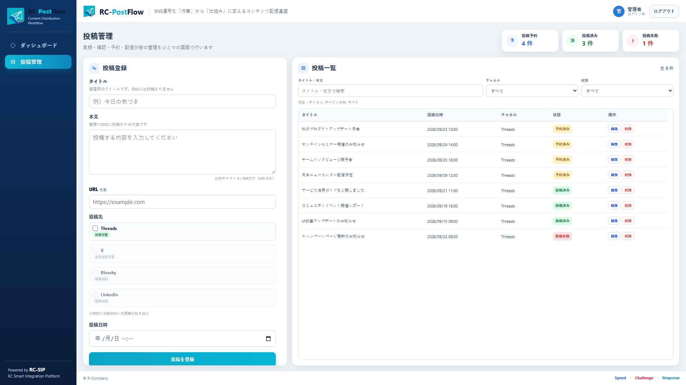

# RC-PostFlow


RC-PostFlowは、SNS投稿の登録、予約、配信結果の確認を一元管理し、SNS運用にかかる作業時間を減らすための投稿管理アプリケーションです。

今回の公開版はRC-PostFlow v0.3.0です。Threadsへの予約投稿に対応したMVPで、単一の管理者が単一インスタンスで運用することを前提としています。

## 画面イメージ



このスクリーンショットは、外部SNSへの投稿を無効にした撮影専用環境で、すべて架空の投稿データを使用して撮影しています。

## v0.3.0で利用できる機能

- Threads投稿の登録、一覧表示、編集、削除
- 日時を指定したThreads予約投稿
- 投稿タイトル、本文、任意URLの入力とバリデーション
- キーワード、チャネル、投稿状態による一覧の絞り込み
- 投稿状態とKPI（投稿予約、投稿済み、投稿失敗）の表示
- 単一管理者によるフォームログイン、CSRF保護、ログアウト
- SQLiteを使用したデータ永続化とFlywayによるスキーマ管理

投稿先はThreadsのみです。即時投稿、画像添付、連続スレッド投稿には対応していません。

v0.3.0の正式サポート対象データベースはSQLiteのみです。PostgreSQL向けのコード、設定、Flyway Migrationは残存していますが、v0.3.0では未検証であり、正式サポート対象外です。

## 投稿状態とKPI

| 内部状態 | 画面表示 | 意味 |
| --- | --- | --- |
| `PENDING` | 予約済み | 登録済みで、Schedulerの処理待ち |
| `SCHEDULED` | 投稿処理中 | Schedulerが対象を取得し、Threadsへの投稿処理を開始済み |
| `POSTED` | 投稿済み | Threads APIから投稿成功の応答を受け、結果を保存済み |
| `ERROR` | 投稿失敗 | 投稿処理中にエラーが発生 |

新規投稿は`PENDING`で登録されます。投稿予約KPIは`PENDING`だけを、投稿済みKPIは`POSTED`、投稿失敗KPIは`ERROR`を集計します。`SCHEDULED`は投稿予約KPIに含まれません。

KPIは全投稿を対象とした集計です。画面のキーワード、チャネル、状態フィルターには追従しないため、絞り込み後の一覧件数と一致しない場合があります。

## 動作環境

| 項目 | 現行設定・バージョン | 確認範囲 |
| --- | --- | --- |
| Java | 25 | Gradle Toolchain。自動テストはEclipse Temurin 25.0.3 LTSで実行 |
| Spring Boot | 3.5.16 | 現行ビルド設定と自動テストで確認 |
| Gradle Wrapper | 8.14.5 | Windowsで自動テストを実行 |
| SQLite JDBC | 3.49.1.0 | 通常SQLiteプロファイルの設定、およびテスト用インメモリDBで確認 |
| PostgreSQL JDBC | 42.7.11 | コードと設定が残存。v0.3.0では実DB接続未検証、正式サポート対象外 |
| テンプレート | Thymeleaf | 現行画面で使用 |

v0.3.0の正式サポート対象はSQLiteのみです。PostgreSQL向けのコード、設定、Migrationは残存していますが、実PostgreSQL環境での接続、Migration、CRUD、予約投稿処理は未検証です。PostgreSQLに関する記載は参考情報であり、動作を保証するものではありません。

## 初回セットアップ

### 1. ソースコードを取得する

GitHubの[RC-PostFlowリポジトリ](https://github.com/r-company-net/rc-postflow)からcloneまたはZIPを取得し、プロジェクトルートへ移動してください。

### 2. 前提環境を確認する

- JDK 25
- Git（cloneする場合）

Gradleの個別インストールは不要です。リポジトリに含まれるGradle Wrapperを使用します。`data/`と`logs/`は空の`.gitkeep`を含むため、clone直後に追加のディレクトリ作成は必要ありません。SQLite DBとログ本体はGit管理対象外です。

v0.3.0の正式な導入方法は、ソースコードを取得してGradle Wrapperから起動する方法です。実行可能JAR単体の配布・起動は正式サポート対象ではありません。

```powershell
# Windows PowerShell
java --version
.\gradlew.bat --version
```

```bash
# Linux / macOS
java --version
./gradlew --version
```

### 3. 管理者Credentialを設定する

次の値は例示用のプレースホルダーです。実際のCredentialをREADME、設定ファイル、シェル履歴、Repositoryへ保存しないでください。

```powershell
# Windows PowerShell（現在のプロセスだけに設定）
$env:RC_POSTFLOW_ADMIN_USERNAME = "<管理者ユーザー名>"
$env:RC_POSTFLOW_ADMIN_PASSWORD = "<十分に長い管理者パスワード>"
```

```bash
# Linux / macOS（現在のシェルだけに設定）
export RC_POSTFLOW_ADMIN_USERNAME='<管理者ユーザー名>'
export RC_POSTFLOW_ADMIN_PASSWORD='<十分に長い管理者パスワード>'
```

### 4. 利用方法を選択する

#### Threadsへ実投稿する場合

正式サポート対象のSQLite環境からThreadsへ実投稿する場合は、アプリケーションを起動する前に有効なThreads Access Tokenを取得し、起動コマンドを実行するものと同じシェルで`THREADS_ACCESS_TOKEN`を設定してください。

```powershell
# Windows PowerShell（現在のプロセスだけに設定）
$env:THREADS_ACCESS_TOKEN = "<有効なThreads Access Token>"
```

```bash
# Linux / macOS（現在のシェルだけに設定）
export THREADS_ACCESS_TOKEN='<有効なThreads Access Token>'
```

Token未設定でもアプリケーションは起動します。ただし、通常のSQLiteプロファイルではSchedulerが動作するため、予約日時を迎えた投稿は設定エラーとなり、状態が`ERROR`（投稿失敗）へ遷移します。

#### 画面操作だけを試す場合

通常のSQLiteプロファイルは使用せず、[撮影専用環境](docs/screenshot-environment.md)を利用してください。撮影専用環境は通常DBから独立しており、Schedulerを生成しないため、Threadsへの外部投稿は発生しません。

### 5. SQLiteで起動する

SQLiteプロファイルでは、プロジェクトルートからの相対パス`./data/rc-postflow.db`を使用します。初回起動時にFlywayがテーブルを作成します。Threadsへ実投稿する場合は、前項の`THREADS_ACCESS_TOKEN`を設定した同じシェルで起動してください。画面操作だけを試す場合は、この通常プロファイルではなく撮影専用環境を使用してください。

```powershell
# Windows PowerShell
.\gradlew.bat bootRun --args="--spring.profiles.active=sqlite"
```

```bash
# Linux / macOS
./gradlew bootRun --args='--spring.profiles.active=sqlite'
```

起動後、ブラウザで`http://localhost:8080/login`を開き、設定した管理者Credentialでログインします。「新規投稿」からタイトル、本文、現在より後の予約日時、投稿先のThreadsを指定して登録してください。登録直後の状態は「予約済み」です。

## 環境変数

### 起動時に必須

| 環境変数 | 用途 |
| --- | --- |
| `RC_POSTFLOW_ADMIN_USERNAME` | 管理者ログインのユーザー名 |
| `RC_POSTFLOW_ADMIN_PASSWORD` | 管理者ログインのパスワード。起動時にBCryptでエンコード |

両方とも空にはできません。値がない場合、アプリケーションは正常に起動しません。

### Threads実投稿時に必須

| 環境変数 | 用途 |
| --- | --- |
| `THREADS_ACCESS_TOKEN` | Threads APIのBearer Access Token |

`THREADS_ACCESS_TOKEN`がなくてもアプリケーション自体は起動しますが、期限を迎えた投稿は設定エラーとなり`ERROR`へ遷移します。TokenはMetaの正式な手順で取得・管理し、Repositoryへ保存しないでください。

`THREADS_APP_ID`と`THREADS_APP_SECRET`は設定クラスに項目がありますが、現行の投稿処理では使用していません。v0.3.0にはAccess Tokenの取得・更新機能はなく、別途用意した`THREADS_ACCESS_TOKEN`を使用します。

### 任意設定

| 環境変数 | 既定値 | 用途 |
| --- | --- | --- |
| `THREADS_CONNECT_TIMEOUT` | `3s` | Threads APIへの接続タイムアウト |
| `THREADS_READ_TIMEOUT` | `10s` | Threads APIからの応答待ちタイムアウト |
| `THREADS_BASE_URL` | `https://graph.threads.net` | Threads APIのベースURL。通常は変更不要 |

環境ごとの秘密情報はOSの環境変数または秘密情報管理サービスから注入してください。

## PostgreSQL実装について（参考情報・正式サポート対象外）

PostgreSQL向けのコード、`application-postgres.yaml`、`db/migration/postgresql`、JDBC依存関係は残存しています。ただし、v0.3.0では実PostgreSQL環境を使用した接続、Migration、CRUD、Scheduler、Threads予約投稿を検証しておらず、正式サポート対象外です。以下は実装確認用の参考情報であり、通常の初回導入手順ではありません。

PostgreSQLプロファイルを起動するには、次の環境変数が必要です。

| 環境変数 | 用途 |
| --- | --- |
| `RC_POSTFLOW_DB_URL` | PostgreSQL JDBC URL |
| `RC_POSTFLOW_DB_USERNAME` | PostgreSQLユーザー名 |
| `RC_POSTFLOW_DB_PASSWORD` | PostgreSQLパスワード |

```powershell
# Windows PowerShell（参考情報）
$env:RC_POSTFLOW_DB_URL = "jdbc:postgresql://<ホスト>:<ポート>/<データベース名>"
$env:RC_POSTFLOW_DB_USERNAME = "<DBユーザー名>"
$env:RC_POSTFLOW_DB_PASSWORD = "<DBパスワード>"
.\gradlew.bat bootRun --args="--spring.profiles.active=postgres"
```

```bash
# Linux / macOS（参考情報）
export RC_POSTFLOW_DB_URL='jdbc:postgresql://<ホスト>:<ポート>/<データベース名>'
export RC_POSTFLOW_DB_USERNAME='<DBユーザー名>'
export RC_POSTFLOW_DB_PASSWORD='<DBパスワード>'
./gradlew bootRun --args='--spring.profiles.active=postgres'
```

PostgreSQLプロファイルでは`classpath:db/migration/postgresql`のMigrationを使用します。利用を検討する場合は、導入先で接続、Migration、CRUD、Scheduler、予約投稿処理を個別に検証してください。

## 管理者認証

- Spring Securityのフォームログインを使用し、ログインURLは`/login`です。
- 管理者は環境変数から起動時に作成される単一のインメモリユーザーです。ユーザー登録、複数ユーザー管理、パスワード再設定機能はありません。
- アプリケーションの画面は認証済みユーザーだけが利用できます。
- CSRF保護は有効です。ログアウトは`POST /logout`で行い、完了後は`/login?logout`へ遷移します。

## Schedulerと運用上の制約

Schedulerは60秒の固定delayで動作し、予約日時を過ぎた`PENDING`投稿を取得します。投稿開始前に`SCHEDULED`を保存し、Threads投稿成功時は`POSTED`、例外発生時は`ERROR`へ更新します。

v0.3.0には次の制約があります。

- 単一管理者、単一アプリケーションインスタンスでの運用を前提とします。
- 自動リトライはありません。`ERROR`はSchedulerの再処理対象になりません。
- `SCHEDULED`保存後にプロセスが停止すると、その状態に滞留し、自動では再処理されません。
- Threads APIへの送信成功後、応答受信やDB更新に失敗した場合は、画面が`ERROR`または`SCHEDULED`でもThreads側には投稿済みの可能性があります。
- 外部投稿IDはDBへ保存しておらず、重複投稿を完全には防止できません。失敗表示の投稿を再登録する前に、必ずThreads側の投稿結果を確認してください。
- 投稿対象の排他制御や複数インスタンス間の分散ロックは実装していません。

## v0.3.0では未対応の機能

- X、Bluesky、LinkedInなどThreads以外のSNS投稿
- 複数投稿をつなげる連続スレッド投稿
- 画像・動画などのメディア添付
- 即時投稿
- 独立したダッシュボード画面
- 複数ユーザー、権限管理、ユーザー登録、パスワード再設定
- Access Tokenの取得、自動更新、失効通知
- 投稿失敗時の自動リトライ、重複投稿の自動検知

## テスト結果

2026年9月22日に、Windows 11、Eclipse Temurin 25.0.3 LTS、Gradle Wrapper 8.14.5で自動テストを実行し、57件すべて成功しました（失敗0、エラー0、スキップ0）。テストではSQLiteのインメモリDBとモック／テスト用HTTP応答を使用しています。

この57件には、CRUD、Validation、Security、Scheduler、Threadsクライアント、投稿状態表示、KPI集計などのテストが含まれます。実際のThreadsサービスへの投稿、および実PostgreSQLへの接続は、この自動テストの確認範囲には含まれません。

Threadsへの実投稿成功は[サニタイズ済みの過去検証履歴](docs/verification-history.md)に記録されていますが、現在のv0.3.0ビルドに対する最新の手動実投稿試験とは区別してください。公開前または導入環境ごとに、有効なTokenを使用した手動確認が必要です。

テストの実行方法は次のとおりです。

```powershell
# Windows PowerShell
.\gradlew.bat test
```

```bash
# Linux / macOS
./gradlew test
```

## 関連ドキュメント

### 現行の運用・確認手順

- [v0.3.0 Release Notes](docs/release-notes-v0.3.0.md) — 公開内容、検証範囲、既知の制約、公開前確認事項
- [撮影専用環境](docs/screenshot-environment.md) — 通常DBと分離し、外部投稿を無効にした画面撮影手順
- [過去の検証履歴](docs/verification-history.md) — `v0.2.0-pre1`の検証実績を公開用にサニタイズした記録

## ライセンスとブランド資産

RC-PostFlowのソースコードは、[Apache License, Version 2.0](LICENSE)に基づいて公開しています。

RC-PostFlow／RC-SIP／R-Companyのロゴ・アイコンなどのブランド画像は、Apache License 2.0の適用対象には含まれません。

公式配布版を変更せずに利用する場合は、アプリケーションに組み込まれたロゴをそのまま表示できます。

第三者がRC-PostFlowを再配布する場合は、改変の有無にかかわらず、対象ブランド画像を削除するか、適法に利用できる画像へ置換してください。

ブランド画像の対象範囲と使用条件は、[ブランド利用ガイドライン](BRANDING.md)を参照してください。

ソフトウェアの改変・再配布時には、Apache License 2.0に基づくライセンス表示等の条件を遵守してください。

## 配布とフィードバック

公開Repositoryは[https://github.com/r-company-net/rc-postflow](https://github.com/r-company-net/rc-postflow)です。バグ報告、改善提案、フィードバックは[GitHub Issues](https://github.com/r-company-net/rc-postflow/issues)を利用してください。

今回の公開版はRC-PostFlow v0.3.0で、ビルド上のバージョンも`0.3.0`です。`v0.2.0`および`v0.2.0-pre1`は過去の開発履歴で使用したタグ名ですが、初回OSS公開用の履歴には引き継ぎません。`v0.3.0`タグとGitHub Releaseはまだ作成していません。

### 公開前の必須確認

- ブランド資産の対象ファイルと権利帰属を最終確認し、`BRANDING.md`へ反映する
- ブランド画像を除去・置換した配布物でもアプリケーションが動作することを確認する
- `build.gradle`、README、Release Note、`v0.3.0`タグ、GitHub Releaseのバージョン表記が一致することを最終確認する
- 将来PostgreSQLを正式サポート対象にする場合は、実DBで接続、Migration、CRUD、Scheduler、予約投稿処理を検証する
- 有効なAccess Tokenを使用してThreads実投稿を手動確認する
